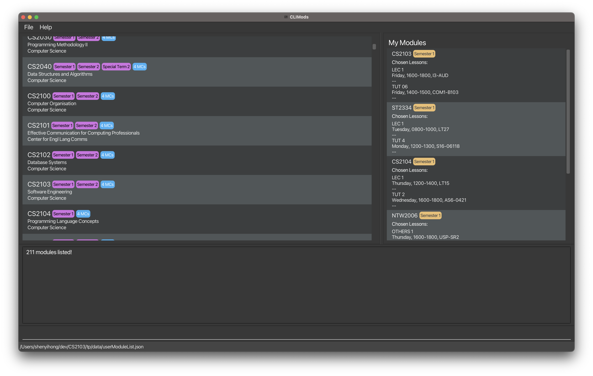

`CLIMods` is a native desktop application for NUS students to explore, manage and plan academic
modules that they are interested in taking. It is primarily optimised for the use via a Command Line
Interface (CLI) while still providing the benefits of a Graphical User Interface (GUI). Power users
of the command line/terminal will be able to plan and manage their modules much faster than doing it
on [nusmods.com](https://www.nusmods.com).

* Table of Contents {:toc}

--------------------------------------------------------------------------------------------------------------------

## Quick start

1. Ensure you have Java `11` or above installed in your Computer.

2. Download the latest `climods.jar`
   from [here](https://github.com/AY2223S1-CS2103-F14-1/tp/releases).

3. Copy the file to the folder you want to use as the _home folder_ for your `CLIMods`.

4. Double-click the file to start the app. The GUI similar to the below should appear in a few
   seconds. 
   

5. Type the command in the command box and press Enter to execute it. e.g. typing **`help`** and
   pressing Enter will open the help window.

6. Refer to the [Features](#features) below for details of each command.

--------------------------------------------------------------------------------------------------------------------

## Features

### User Manual: `help`

Format: `help`

Provides the user manual for all supported commands.

### Listing modules: `ls`

Format: `ls [FACULTY-PREFIX]`

Optional Arguments:

- `FACULTY-PREFIX`
    - e.g. `CS`, `CEG`

Shows the entire list of modules offered by NUS with the option to also filter it by faculty (via
module prefix e.g. CS, CEG).

### Searching for modules: `find`

Format: `find KEYWORD`

Required Arguments:

- `KEYWORD`
    - Any keyword to search against the list of modules
    - A keyword can be a regex expression
        - e.g. `^CS20\d0$`

Search for a (list of) module in the entire list of modules offered by NUS.

### View module details: `view`

Format: `view MODULE-CODE`

Required Arguments:

- `MODULE-CODE`
    - e.g. `CS2103`

View full details (e.g. description, workload) of a module via its module code.

### Add modules to user list: `add`

Format: `add MODULE-CODE SEMESTER-CODE`

Required Arguments:

- `MODULE-CODE`
    - e.g. `CS2103`
  
- `SEMESTER-CODE`
    - `s1`, Semester 1
    - `s2`, Semester 2
    - `st1`, Special Term 1
    - `st2`, Special Term 2

Add a module to the user's own list of modules.

### Delete a module from user list: `rm`

Format: `rm MODULE-CODE`

Required Arguments:

- `MODULE-CODE`
    - e.g. `CS2103`

Delete a module to the user's own list of modules.

### Exiting the program: `exit`

Format: `exit`

Exits the program

### Previous/Next command: `<Up>/<Down>`

Using the `<Up>` and `<Down>` arrow keys, users can traverse through the command history.

Traverse/Scroll **up**: `<Up>`

Traverse/Scroll **down**: `<Down>`

> Do note that the implementation of the command history will not keep track of consecutive 
> duplicate commands. This is to prevent clutter in the command history. Therefore, a command
> sequence like `ls CS` followed by another `ls CS` will only have one record in the command history.

--------------------------------------------------------------------------------------------------------------------

## Command summary

Action | Format, Examples
--------|------------------
**help** | `help`  e.g. `help find`
**ls** | `ls [FACULTY-PREFIX]`  e.g. `ls`, `ls CS`, `ls MA --user`
**find** | `find KEYWORD`  e.g. `find compilers`
**view** | `view MODULE-CODE`  e.g. `view CS2103`
**add** | `add MODULE-CODE`  e.g. `add CS2103`
**rm** | `rm MODULE-CODE`  e.g. `rm CS2103`
**exit** | `exit`
